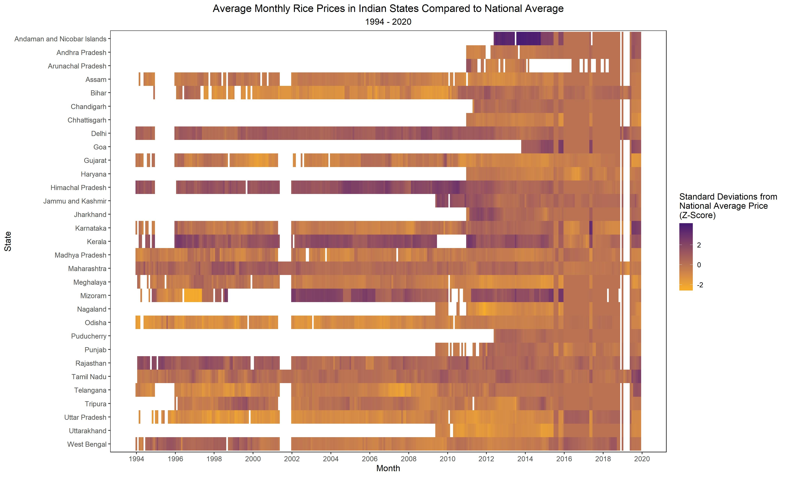
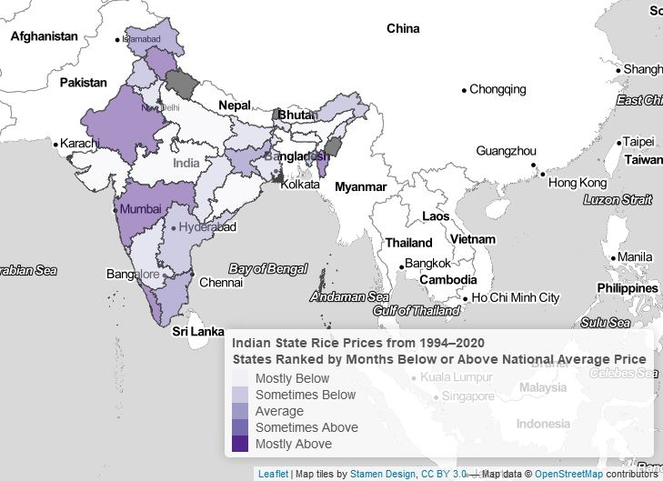

# wfp-foodprices
A set of R tools for analyzing the "Global Food Prices Database" maintained by the World Food Programme.

# Description of Dataset:
  This dataset contains Global Food Prices data from the World Food Programme with over 1 million entries covering foods such as maize, rice, beans, fish, and sugar for 76 countries and some 1,500 markets. It is updated weekly but contains to a large extent monthly data. The data goes back as far as 1992 for a few countries, although many countries started reporting from 2003 or thereafter. (humdata.org)
  
<b>Link:</b>
  https://data.humdata.org/dataset/wfp-food-prices
   
  (The csv will be called 'wfpvam_foodprices.csv' when downloaded.)
  

# Sample Analysis:

# Description of Repository:

### Overview ###
There are two main analyses performed on this dataset:
1. Files (2) and (3) focus on identifying pairs of countries for which price returns for the same commodity are highly-correlated, and create a ranking of every country-crop pair with at least X months of data. If the same crop follows similar price patterns in two coutnries, we can infer that the markets of these two countries are fairly integrated. The findings show that the most correlations country-crop markets are neighboring countries. One should note that food prices in this dataset are listed in local currencies. Due to this, we are also implicitly measuring whether the currencies of two countries are moving in tangent, which is actually helpful for measuring the extent to which country-crop markets are integrated, particularly if a producer or consumer is searching for substitutable markets. 
2. File (4) merges data from Wikipedia to aggregate prices in Indian regional markets to states, and present analyses comparing these state prices to the national average.  These are the tables shown above. 

### Data ###
1. World Food Programme - Global Food Prices Database

### Code ###
1. Import and Clean Dataset
2. Correlation of Prices for Country-Crop Pairs
3. Charting Price Returns for Country-Crop Pairs (return distributions, indexed returns, and scatterplot)
4. Indian state prices
